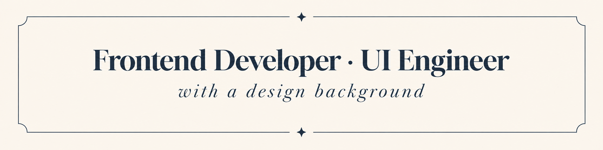

<!-- 🌟 Custom Banner -->

  

<!-- 👋 Typing Intro -->

  

<h1 align="center">Hey there 👋, I'm Jaspreet</h1>
<h3 align="center">Frontend Developer & UI Engineer | Design Background ✨</h3>

<!-- 🔗 Social & Portfolio Links -->

  
  
  
  

  
  

---

## ✨ About Me

💡 I'm a **Frontend Developer with a UI/UX design background**, focused on turning Figma
systems into responsive, component-based interfaces that ship.
🎨 I combine design judgment, clean component architecture, and smooth interaction detail
(GSAP) in everything I build.

- 🚀 **Building production-ready interfaces, from Figma to code**
- 🌀 Strong focus on **motion and interaction design (GSAP, ScrollTrigger)**
- 💼 Frontend Developer @ _Tech Prastish Software Solutions Pvt Ltd_
- 🌱 Currently deepening: **automated testing (RTL/Vitest) and accessibility**

---

## 💻 Frontend Development

  
  
  
  
  
  
  

---

## 🎨 Design

  
  

---

## 🌀 Animation & Interaction

  
  

---

## 🛒 CMS & E-Commerce

  
  
  

---

## 🛠️ Tools

  
  
  

---

## 📊 GitHub Stats & Activity

   

---

## 💡 Quote of the Day

  

